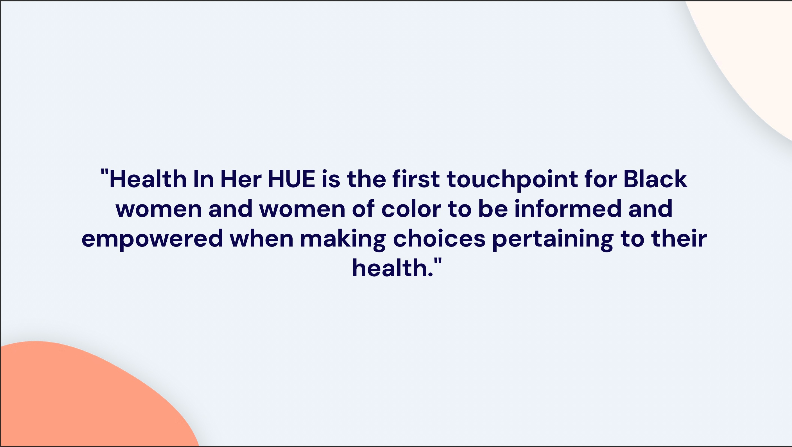
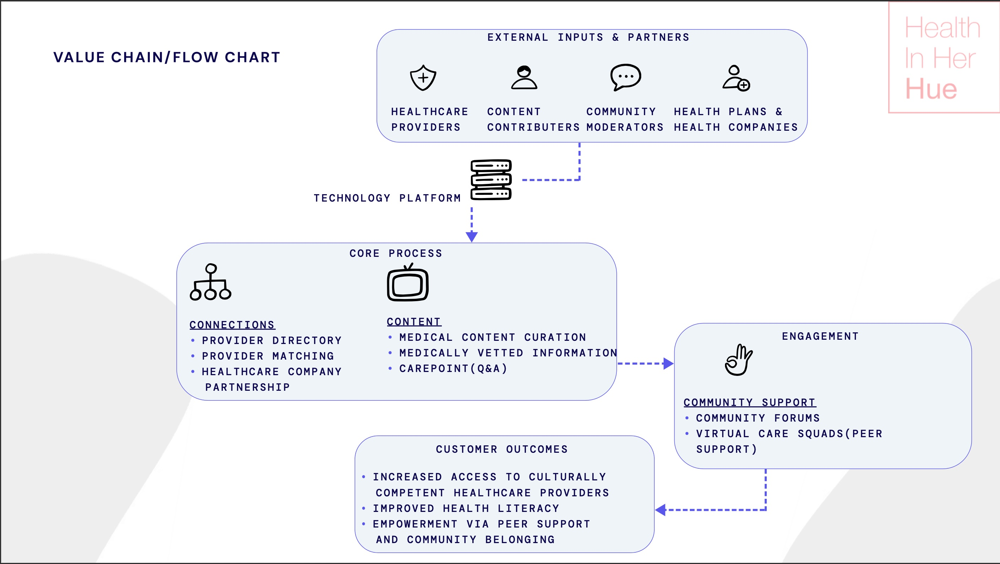
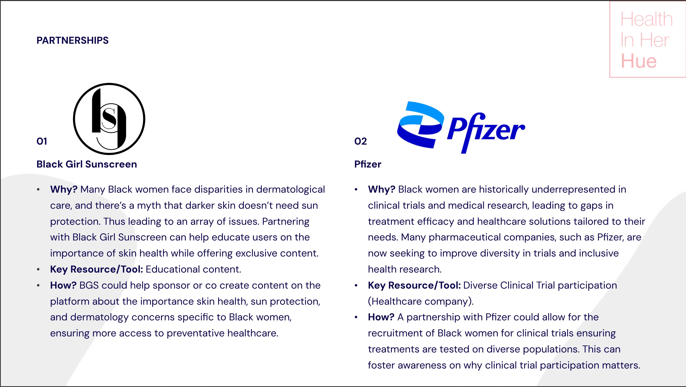

# Startup Strategy Analysis

Plug and Play Tech Center X Health in Her Hue

## PDF File
  
- <a href="https://github.com/Yac-ubr/Startup-Strategy-Analysis-Plug-and-Play-Tech-Center/blob/main/StartupStrategyAnalysisYacubmahamoud.pdf">PDF</a>
  

# Project Objective

The main objectives of this project is to provide:

A strategic analysis of Health In Her HUE, a digital health platform designed to support Black women and women of color by connecting them to culturally competent healthcare providers, community support, and medically vetted educational resources.
The goal of this analysis is to examine the company’s value proposition, product features, market opportunity, value chain, and potential strategic partnerships.

# Project Goals

- Analyze the company’s value proposition and how it addresses the needs of Black women and women of color in healthcare

- Evaluate core product features including provider matching, educational content, community support, and telehealth capabilities

- Identify the market opportunity with a focus on gaps in culturally competent healthcare solutions and DEI-driven demand

- Map and assess the company’s value chain including key processes, inputs, and customer outcomes

- Explore and recommend strategic partnerships that strengthen brand reach, community impact, and healthcare equity

## Slidedeck Screenshots

